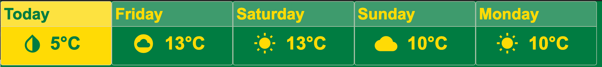

# Sun or Snow - A Weather Widget

This is an HTML weather widget that can be used with Brightsign screens.

## Building

This project requires npm to install the packages required.
Run `npm run-script start` to view it in a development setting.
Run `npm run-script build` to build the project.  The code will be in the `dist` folder.

## Altering the data source

In the [index.tsx](src/index.tsx) file, you can alter the URL that the data is fetched from.
It has be tailored to parse the data from the [Environment Canada Website](https://weather.gc.ca/).
Any of the RSS weather feeds should work [(example)](https://weather.gc.ca/rss/city/ab-71_e.xml).
